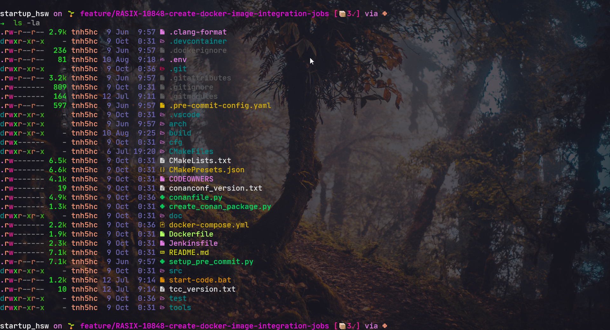
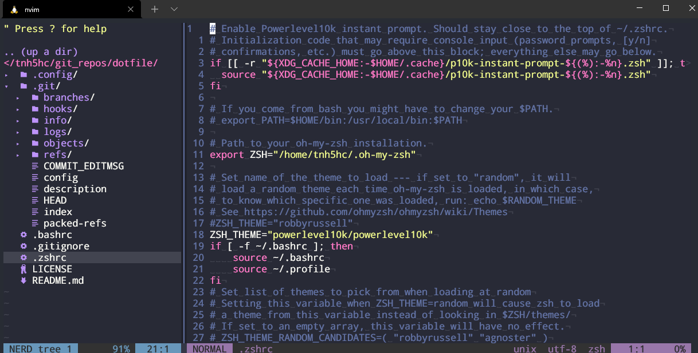

# Nhat's dotfiles

**Warning**: Don’t blindly use my settings unless you know what that entails. Use at your own risk! <br />
Below config are working on WSL2(Ubuntu 18 & Ubuntu 20)
# Screenshots:
## Contents
- NeoVim setup
- Shell setup(ZSH)
- EXA - `ls` relacement

## Pre-Setup
Disable sudo password for user - replace $USER to your username
```
sudo visudo
```
```
$USER ALL=(ALL) NOPASSWD: ALL
```

## NeoVim setup
Requires Neovim (>= 0.7)
- [Neovim](https://github.com/neovim/neovim)
- [vim-plug](https://github.com/junegunn/vim-plug) - A minimalist Vim plugin manager
- [nvim-treesitter](https://github.com/nvim-treesitter/nvim-treesitter) - [Treesitter](https://github.com/tree-sitter/tree-sitter) configurations and abstraction layer for Neovim
- [telescope.nvim](https://github.com/nvim-telescope/telescope.nvim) - A highly extendable fuzzy finder over lists
### Install NEOVIM

```
# Assume you're in your home and it was downloaded to the Downloads folder - move it to a sensible location, e.g.
mkdir -p ~/.local/share/nvim
cd ~/.local/share/nvim/
wget https://github.com/neovim/neovim/releases/download/v0.7.0/nvim.appimage
# Mark it executable
chmod u+x nvim.appimage && ./nvim.appimage
# Create .local/bin if it doesn't exist yet, and link the appimage there under the name "nvim"
mkdir -p ~/.local/bin
ln -s $HOME/.local/share/nvim/nvim.appimage ~/.local/bin/nvim
```
now you can type `nvim`
<br />
if it's not working you need add the PATH to ~/.profile or ~/.bashrc

```
# set PATH so it includes user's private bin if it exists
if [ -d "$HOME/.local/bin" ] ; then
    PATH="$HOME/.local/bin:$PATH"
fi
```

### Copy Neovim config
```
mkdir -p ~/.config/nvim/ && cp -r .config/nvim/* ~/.config/nvim
```
- maybe you will be get ^M format error so you need to install dos2unix and reformat all file.
```
sudo apt-get install tofrodos; sudo ln -s /usr/bin/fromdos /usr/bin/dos2unix
```
```
dos2unix init.vim & dos2unix maps.vim & dos2unix plug.vim & dos2unix after/coc.rc.vim & dos2unix after/fzf.rc.vim & dos2unix after/lightline.rc.vim & dos2unix after/nerdtree.rc.vim &  dos2unix after/telescope.rc.vim
```
### Install VimPLug
```
sh -c 'curl -fLo "${XDG_DATA_HOME:-$HOME/.local/share}"/nvim/site/autoload/plug.vim --create-dirs \
       https://raw.githubusercontent.com/junegunn/vim-plug/master/plug.vim'
```
Now you can install plugin.
```
nvim  ~/.config/nvim/init.vim
:PlugInstall
```

If you want to update plug.vim or vim config some commands below will help you get out the stuff:
* `:checkhealth` - after install plugin you can type this command for list issues of neovim
* `:verbose imap <tab>` - for checking hotkey already mapped, if you want to add new hotkey should run this command first
* `:so %` - for `source <current file>`
* after install if have any error you can refer my [Error-List](#error-list)

## Uninstall Neovim
```
cd ~/.local/share/nvim/
rm -rf nvim.appimage
```


## Shell setup

- ZSH shell
- [OHMYZSH](https://github.com/ohmyzsh/ohmyzsh)
- [ZINIT](https://github.com/zdharma-continuum/zinit)
- [p10k](https://github.com/romkatv/powerlevel10k)
- [Nerd fonts](https://github.com/ryanoasis/nerd-fonts) - Powerline-patched fonts. I use DroidSansMono.
- [Exa](https://the.exa.website/) - `ls` replacement


### Install ZSH
`sudo apt install zsh`
- INSTALL OHMYZSH

`sh -c "$(curl -fsSL https://raw.githubusercontent.com/ohmyzsh/ohmyzsh/master/tools/install.sh)"`

- bind-key for OHMYZSH(already added in my .zshrc)
`bindkey '^ ' autosuggest-accept`
from here you can copy my .zsh to ~/.zshrc
### Copy ZSH config
```
git clone https://github.com/nhattran2311/dotfile.git
cd dotfile && cp .zshrc ~/.zshrc && cp .bashrc ~/.bashrc
```
<br />

### ZSH plugin 
- Install autosuggestion,zsh-aliases-exa for zshrc

```
cd ~/.oh-my-zsh/custom/plugins && git clone https://github.com/DarrinTisdale/zsh-aliases-exa && git clone https://github.com/zsh-users/zsh-autosuggestions.git
```


### p10k
- Install:
```
git clone --depth=1 https://github.com/romkatv/powerlevel10k.git ${ZSH_CUSTOM:-$HOME/.oh-my-zsh/custom}/themes/powerlevel10k
```
- Copy p10k configure:
```
cp .p10k.zsh ~/.p10k.zsh
```

### EXA
- INSTALL Rust Enviroment
`curl --proto '=https' --tlsv1.2 -sSf https://sh.rustup.rs | sh`
Press 1 to continue install.
<br />

- Install EXA
`cargo install exa`

- You also can install it manually by following command:
```
wget -c https://github.com/ogham/exa/releases/download/v0.9.0/exa-linux-x86_64-0.9.0.zip
unzip exa-linux-x86_64-0.9.0.zip
sudo mv exa-linux-x86_64 /usr/local/bin/exa
```

#### Issue:
Rust Error “linker ‘cc’ not found” On Linux
solution:
`sudo apt install build-essential`


### fzf
```
git clone --depth 1 https://github.com/junegunn/fzf.git ~/.fzf
~/.fzf/install
```

### RIPGREP
This plugin us required for fzf to search file in neovim
```
sudo apt-get install ripgrep
```

### Make all things work
`source ~/.zshrc`

### INSTALL NERDFONT FOR WSL2
DOWNLOAD your font to Windows PC:
https://www.nerdfonts.com/font-downloads

click the font and install it. Then go to Windows Terminal to select the font your are installed.
maybe you can change the config file json in Windows terminal like this:
```
"profiles": 
{
"defaults": 
        {
                "font": 
                {
                    "face": "DroidSansMono Nerd Font"
                },
        },
}
```

## ERROR-LIST
1. python not found in neovim
- Solution:
```
sudo apt install python3-pip && pip3 install pynvim
```
<br />

2. coc error: not find nodejs
solution:
```
curl -fsSL https://deb.nodesource.com/setup_17.x | sudo -E bash -
sudo apt-get install -y nodejs
sudo npm install yarn --global
cd ~/.local/share/nvim/plugged/coc.nvim
yarn install & yarn build
```
<br />

3. clipboard not found
- Solution:
```
sudo apt-get install -y xclip
```
* If you using wsl for neovim. install manually with following below command:
```
curl -sLo/tmp/win32yank.zip https://github.com/equalsraf/win32yank/releases/download/v0.0.4/win32yank-x64.zip \
&& sudo apt install zip \
&& unzip -p /tmp/win32yank.zip win32yank.exe > /tmp/win32yank.exe \
&& chmod +x /tmp/win32yank.exe \
&& sudo mv /tmp/win32yank.exe /usr/local/bin/
```
https://github.com/neovim/neovim/wiki/FAQ#how-to-use-the-windows-clipboard-from-wsl
issue #6227


### FOR WHO USING VISUAL STUDIO CODE
add this config to VSC for fix icon format.
```
 "terminal.integrated.fontFamily": "DroidSansMono Nerd Font",
```
