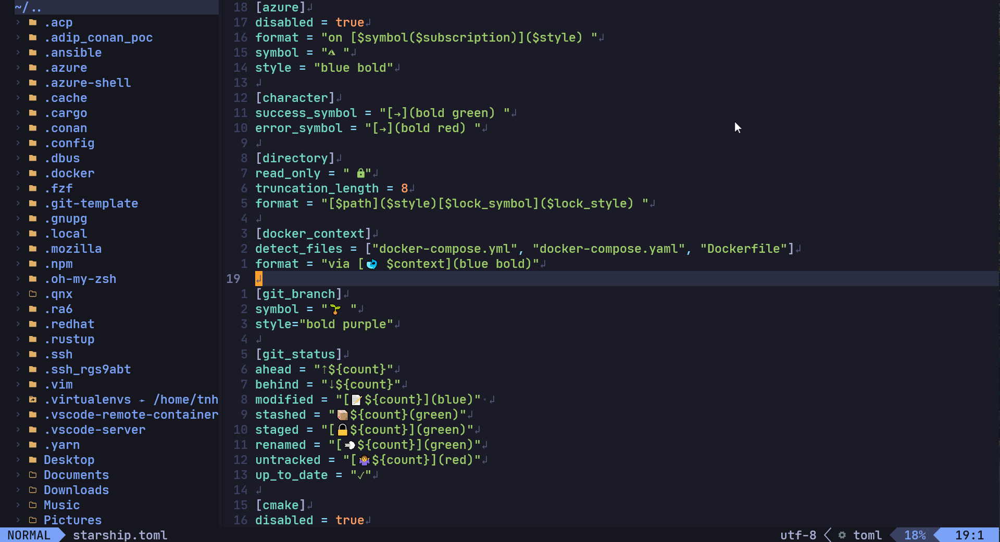

# Nhat's dotfiles

**Warning**: Don’t blindly use my settings unless you know what that entails. Use at your own risk! <br />
The following configuration is compatible with WSL2 (Ubuntu 18 & Ubuntu 20), Kali Linux, and Docker environments.

# Screenshots:
## Contents
- NeoVim setup
- ZSH

## Pre-Setup
Disable the sudo password for your user account. Replace `$USER` with your username.

```
sudo visudo
```
Then add the following line:
```
$USER ALL=(ALL) NOPASSWD: ALL
```

# Automation Setup
For automated setup, please refer to this Ansible script: [https://github.com/nhattran2311/ansible](https://github.com/nhattran2311/ansible)


# Manual Setup

## Copying Dotfiles Configuration
Clone the dotfiles repository and copy the configuration files to the appropriate locations.

```
git clone https://github.com/nhattran2311/dotfiles.git dotfiles
```

```
cd dotfile && cp .zshrc ~/.zshrc
```
```
mkdir -p ~/.config/nvim/ && cp -r .config/nvim/* ~/.config/nvim
```

## NeoVim
Requires Neovim (>= 0.7)
- [Neovim](https://github.com/neovim/neovim)
### Installing NEOVIM

Download and place the Neovim app image in the appropriate directory.

```
mkdir -p ~/.local/share/nvim && wget https://github.com/neovim/neovim/releases/download/v0.10.0/nvim.appimage -P ~/.local/share/nvim/
```

Install fuse:
```
sudo apt install fuse
```

Make the app image executable and run it:
```
chmod u+x ~/.local/share/nvim/nvim.appimage && ~/.local/share/nvim/nvim.appimage
```

If it doesn't exist yet, create .local/bin and link the app image there under the name "nvim":


```
mkdir -p ~/.local/bin && ln -s $HOME/.local/share/nvim/nvim.appimage ~/.local/bin/nvim
```

### Install Packer
```
git clone --depth 1 https://github.com/wbthomason/packer.nvim\
 ~/.local/share/nvim/site/pack/packer/start/packer.nvim
```


```
nvim --headless -c 'autocmd User PackerComplete quitall' -c 'PackerSync'
```
- Now, you can enable the Tokyo theme in ~/.config/nvim/lua/hori/base.lua
- If you want to update plug.vim or vim config, the commands below will help you:
* `:checkhealth` - After installing the plugin, you can type this command to list issues.
* `:verbose imap <tab>` - This command checks if a hotkey is already mapped. Run this command before adding a new hotkey.
* `:so %` - This command sources the current file.
If you encounter any errors after installation, you can refer to my [Error-List](#error-list).


## ZSH
### Install ZSH
To install ZSH, use the following command:
```sudo apt install zsh```

### Install OHMYZSH
To install OHMYZSH, use the following command:
```sh -c "$(curl -fsSL https://raw.githubusercontent.com/ohmyzsh/ohmyzsh/master/tools/install.sh)"```

### ZSH plugin 
Install the autosuggestion and zsh-aliases-exa plugins for zshrc with the following command:

```
git clone https://github.com/DarrinTisdale/zsh-aliases-exa ~/.oh-my-zsh/custom/plugins/zsh-aliases-exa && git clone https://github.com/zsh-users/zsh-autosuggestions.git ~/.oh-my-zsh/custom/plugins/zsh-autosuggestions
```

### Starship
To install Starship, use the following command:

```
curl -sS https://starship.rs/install.sh | sh
```
#### Configuration
To copy the configuration, use the following command:

```
cp .config/starship.toml ~/.config/starship.toml
```

### EXA
#### Installing the Rust Environment
To install the Rust environment, use the following command:

```
curl --proto '=https' --tlsv1.2 -sSf https://sh.rustup.rs | sh
```
#### Source the Rust Environment
To source the Rust environment, use the following command:

```
source "$HOME/.cargo/env"
```
#### Installing EXA
To install EXA, use the following command:

```
cargo install exa
```

You can also install it manually with the following commands:

```
wget -c https://github.com/ogham/exa/releases/download/v0.9.0/exa-linux-x86_64-0.9.0.zip &&
unzip exa-linux-x86_64-0.9.0.zip &&
sudo mv exa-linux-x86_64 /usr/local/bin/exa
```
#### ZSH Aliases
To install ZSH aliases for EXA, use the following command:
```
git clone https://github.com/DarrinTisdale/zsh-aliases-exa ~/.oh-my-zsh/custom/plugins/zsh-aliases-exa
```

##### Issue:
If you encounter the Rust Error “linker ‘cc’ not found” on Linux, you can resolve it by installing the build-essential package:

```sudo apt install build-essential```


### fzf
To install fzf, use the following commands:
```
git clone --depth 1 https://github.com/junegunn/fzf.git ~/.fzf
~/.fzf/install
```

### RIPGREP
To install fzf, use the following commands:
```
sudo apt-get install ripgrep
```

### Final Step
To apply all the changes, source the ZSH configuration file:
```source ~/.zshrc```

### Installing Nerd Fonts for WSL2
First, download your preferred font from the Nerd Fonts collection to your Windows PC:

[https://www.nerdfonts.com/font-downloads](https://www.nerdfonts.com/font-downloads)

After downloading, click on the font file to install it. Then, open Windows Terminal and select the installed font. You may need to modify the configuration file (JSON) in Windows Terminal to reflect this change.
You may need to modify the configuration file (JSON) in Windows Terminal as follows:
```
"profiles": 
{
"defaults": 
        {
                "font": 
                {
                    "face": "DroidSansMono Nerd Font"
                },
        },
}
```

# ERROR-LIST
If you encounter any errors during the setup, please refer to the following solutions:

1. **Error**: Python not found in Neovim
   - **Solution**: Install Python and the pynvim package with the following commands:
   ```
   sudo apt install python3-pip
   pip3 install pynvim
   ```

2. **Error**: coc error - Node.js not found
   - **Solution**: Install Node.js, yarn, and build coc.nvim with the following commands:
   ```
   curl -fsSL https://deb.nodesource.com/setup_17.x | sudo -E bash -
   sudo apt-get install -y nodejs
   sudo npm install yarn --global
   cd ~/.local/share/nvim/plugged/coc.nvim
   yarn install & yarn build
   ```


3. **Error**: `xclip` not found/clipboard not found
   - **Solution**: Install `xclip` with the following command:
   ```
   sudo apt-get install -y xclip
   ```
   If you are using WSL for Neovim, install manually with the following command:
   ```
   curl -sLo/tmp/win32yank.zip https://github.com/equalsraf/win32yank/releases/download/v0.0.4/win32yank-x64.zip \
   && sudo apt install zip \
   && unzip -p /tmp/win32yank.zip win32yank.exe > /tmp/win32yank.exe \
   && chmod +x /tmp/win32yank.exe \
   && sudo mv /tmp/win32yank.exe /usr/local/bin/
   ```
   For more information, refer to the [Neovim FAQ](https://github.com/neovim/neovim/wiki/FAQ#how-to-use-the-windows-clipboard-from-wsl).

4. **Error**: File format issues (e.g., ^M format error)
   - **Solution**: Install `dos2unix` and reformat all files:
   ```
   sudo apt-get install tofrodos; sudo ln -s /usr/bin/fromdos /usr/bin/dos2unix
   ```
   ```
   dos2unix init.vim & dos2unix maps.vim & dos2unix plug.vim & dos2unix after/coc.rc.vim & dos2unix after/fzf.rc.vim & dos2unix after/lightline.rc.vim & dos2unix after/nerdtree.rc.vim &  dos2unix after/telescope.rc.vim
   ```

### For Visual Studio Code Users
Add the following configuration to Visual Studio Code to fix the icon format:
```
"terminal.integrated.fontFamily": "DroidSansM Nerd Font",
```
# Checking Keybindings for Linux
To check if a specific keybinding is already in use, you can use the `bindkey` command. For example, to check if the keybinding `^R` is in use, run the following command:
```
bindkey | grep '^"^R'
```

## Uninstalling Neovim
If you need to uninstall Neovim, navigate to the directory where the Neovim app image is located and remove it. Here's how you can do it:
```
cd ~/.local/share/nvim/
rm -rf nvim.appimage
```
Please note that this will only remove the Neovim executable. If you want to remove all Neovim-related configurations and plugins, you should also remove the `~/.config/nvim` directory.

## Updating Neovim
To update Neovim, you can simply download the latest app image and replace the existing one. Here's how you can do it:
```
cd ~/.local/share/nvim/
rm -rf nvim.appimage
wget https://github.com/neovim/neovim/releases/download/v0.10.0/nvim.appimage
chmod u+x nvim.appimage
```
Remember to replace `v0.10.0` with the version number of the latest release.